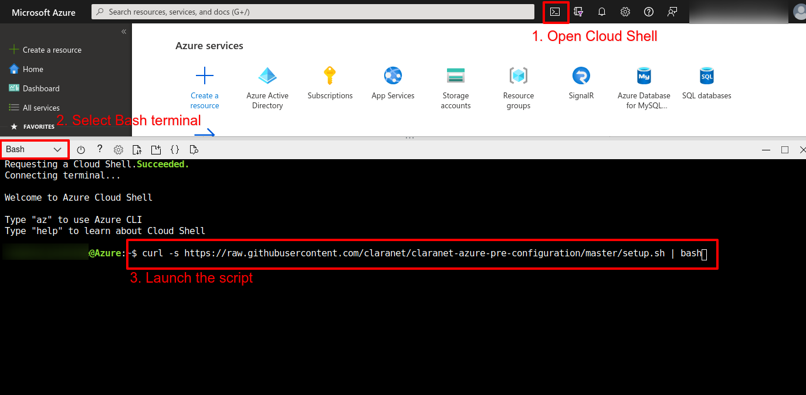

# Claranet Azure pre-configuration script

The purpose of this script is to execute all necessary high privileges actions 
needed by Claranet for Azure subscriptions management.

This includes:
* Creation of a "claranet-tools" (or any other given name) [service principal](https://docs.microsoft.com/en-us/azure/active-directory/develop/app-objects-and-service-principals)
* Rights assignment of this service principal to needed subscription with following rights
    * [_Reader_](https://docs.microsoft.com/en-us/azure/role-based-access-control/built-in-roles#reader) for inventory and monitoring purposes
    * [_Cost Management Reader_](https://docs.microsoft.com/en-us/azure/role-based-access-control/built-in-roles#cost-management-reader) for FinOps purposes
    * [_Log Analytics Reader_](https://docs.microsoft.com/en-us/azure/role-based-access-control/built-in-roles#log-analytics-reader) for monitoring purpose
* Optional creation of a "Claranet DevOps" user group and rights assignment on subscriptions
* FrontDoor service principal creation for FrontDoor identity management. 
  See [Related documentation](https://docs.microsoft.com/en-us/azure/frontdoor/standard-premium/how-to-configure-https-custom-domain#register-azure-front-door)

A report is generated at the end of the script and needs to be provided to Claranet **in a secure way**.

# Prerequisites

In order to play this script, you'll need:
* Azure Active Directory privileges for creating Service Principals
* A terminal with the Azure CLI configured (it can be [Azure Cloud Shell](https://docs.microsoft.com/en-us/azure/cloud-shell/overview))
* Azure Subscriptions to configure rights on them

# How to use it

## With Azure Cloud Shell (recommended)

You can find Azure Cloud Shell documentation here: [https://docs.microsoft.com/en-us/azure/cloud-shell/overview](https://docs.microsoft.com/en-us/azure/cloud-shell/overview)

Open Azure Cloud Shell from the Azure portal in Bash mode and launch the following command:
```shell
bash <(curl -s https://raw.githubusercontent.com/claranet/claranet-azure-pre-configuration/master/setup.sh)
```



## From your terminal

Either clone this repository or download the script `setup.sh` locally and launch it in your terminal or launch the
following command locally:

```shell
bash <(curl -s https://raw.githubusercontent.com/claranet/claranet-azure-pre-configuration/master/setup.sh)
```
